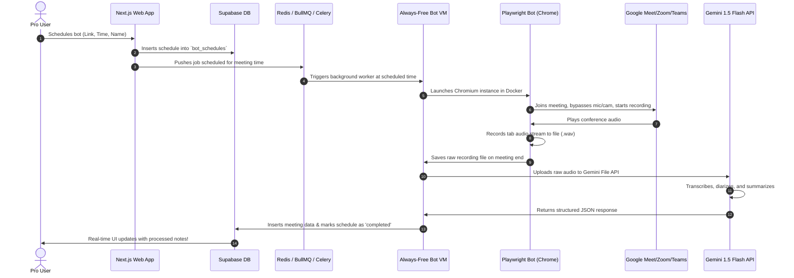

# 🤖 Recall AI Autopilot Backend Implementation Plan
**For the Backend Engineer**

This document provides the technical blueprints and architectural steps to implement the **Recall AI Autopilot Bot**. 

The frontend scheduling interface and the `/api/bot/schedule` routing engine are **100% complete** and integrated. When a premium user schedules a bot, the frontend auto-detects the platform (Google Meet, Zoom, MS Teams), configures AI processing settings (language, style, diarization), and posts a payload to `/api/bot/schedule`.

Your task is to build the asynchronous scheduler queue, headless bot browser orchestrator, audio recording system, and Gemini-based AI synthesis engine.

---

## 🏗 System Architecture

The following diagram illustrates how scheduled autopilot events flow through the system:



---

## 🗄 1. Database Schema
A migration file `supabase/migrations/20260521_create_bot_schedules_table.sql` has already been generated and saved. Run this migration in your Supabase project to provision the `bot_schedules` table:

```sql
CREATE TABLE IF NOT EXISTS public.bot_schedules (
  id             UUID PRIMARY KEY DEFAULT gen_random_uuid(),
  user_id        UUID NOT NULL REFERENCES auth.users(id) ON DELETE CASCADE,
  meeting_link   TEXT NOT NULL,
  scheduled_at   TIMESTAMP WITH TIME ZONE NOT NULL,
  bot_name       TEXT NOT NULL DEFAULT 'Recall Note Taker',
  platform       TEXT NOT NULL DEFAULT 'custom' CHECK (platform IN ('google-meet', 'zoom', 'teams', 'custom')),
  settings       JSONB NOT NULL DEFAULT '{"diarize": true, "actions": true, "language": "en", "style": "detailed"}',
  status         TEXT NOT NULL DEFAULT 'scheduled' CHECK (status IN ('scheduled', 'joining', 'recording', 'processing', 'completed', 'failed')),
  error_message  TEXT,
  meeting_id     UUID REFERENCES public.meetings(id) ON DELETE SET NULL,
  created_at     TIMESTAMP WITH TIME ZONE DEFAULT NOW(),
  updated_at     TIMESTAMP WITH TIME ZONE DEFAULT NOW()
);
```

---

## ⏰ 2. Asynchronous Job Scheduling
Since serverless routes on Next.js/Vercel have short timeouts (e.g. 60s max) and meetings can last hours, the scheduling queue **must run on a dedicated worker service**.

### Node.js/NestJS Approach (Recommended)
Use **Redis** and **BullMQ** on a lightweight, always-free virtual machine:
1. **Enqueuing:** In your `/api/bot/schedule` route, after inserting the DB row, add a job to the Redis queue with a delay:
   ```typescript
   import { Queue } from 'bullmq';
   const autopilotQueue = new Queue('autopilot-bots');

   // Calculate delay in milliseconds
   const delayMs = new Date(scheduledAt).getTime() - Date.now();

   await autopilotQueue.add('join-meeting', {
     scheduleId: data.id,
     link,
     botName,
     settings
   }, { delay: delayMs });
   ```
2. **Worker Service:** Build a background service that listens to the `autopilot-bots` queue, spins up a Playwright container, and coordinates the processing steps.

---

## 🤖 3. Headless Browser Automation (Playwright)
To achieve zero-cost operation, host headless Chromium browsers inside Docker containers on a free VM (e.g. **Oracle Cloud Infrastructure (OCI) Always-Free ARM VM** which provides 4 OCPUs, 24 GB RAM, and a 200 GB SSD).

### Google Meet Playwright Joing-Script Guide
```javascript
const { chromium } = require('playwright');

async function launchBot(meetingLink, botName) {
  const browser = await chromium.launch({
    headless: true,
    args: [
      '--use-fake-ui-for-media-stream', // Bypasses mic/cam permissions prompt
      '--use-fake-device-for-media-stream',
      '--allow-file-access-from-files',
      '--disable-gesture-requirement-for-media-playback',
    ]
  });

  const context = await browser.newContext();
  const page = await context.newPage();

  // Bypassing initial audio constraints
  await page.goto(meetingLink);

  // 1. Enter the display name in Google Meet Input
  await page.fill('input[type="text"]', botName);

  // 2. Turn off mic & camera using shortcuts or selectors
  // (Google Meet shortcut: Ctrl/Cmd + D for mic, Ctrl/Cmd + E for camera)
  await page.keyboard.press('Control+d');
  await page.keyboard.press('Control+e');

  // 3. Click the "Ask to join" or "Join now" button
  await page.click('button:has-text("Ask to join"), button:has-text("Join now")');

  // 4. Start recording tab audio... (See Section 4)
  
  return { browser, page };
}
```

### Zoom and Microsoft Teams Bypasses
* **Zoom:** Append `?pwd=...` if available, and force the page to join the **Web Client** instead of launching the native app:
  * Redirect to `https://zoom.us/wc/join/{meeting-id}` to run fully inside Chromium.
* **Teams:** Force the browser to use the web client by dismissing the modal that prompts to open the desktop app, and sign in as a guest.

---

## 🎙 4. Zero-Cost Audio Recording (Tab Stream Capture)
To capture the call audio inside a headless browser without installing virtual soundcards on the host OS:

### Method A: Web Audio API Capture (Zero Native Dependencies)
Inject a script into the page that intercepts the browser's audio nodes and saves them using `MediaRecorder`:
```javascript
// Run inside page.evaluate() after joining the meeting:
const stream = await navigator.mediaDevices.getUserMedia({ audio: true, video: false });
const audioContext = new (window.AudioContext || window.webkitAudioContext)();
const source = audioContext.createMediaStreamSource(stream);
const destination = audioContext.createMediaStreamDestination();
source.connect(destination);

const mediaRecorder = new MediaRecorder(destination.stream);
const chunks = [];
mediaRecorder.ondataavailable = (e) => chunks.push(e.data);
mediaRecorder.onstop = () => {
  const blob = new Blob(chunks, { type: 'audio/wav' });
  // Send this blob back to node / save as a file
};
mediaRecorder.start();
```

### Method B: Playwright Browser Audio Recording (Direct Page Recording)
Use standard Chrome DevTools Protocol to capture screen screencasts with audio, or leverage node-libraries like `playwright-video` / custom extensions to capture the chromium output.

---

## ⚡ 5. Google Gemini 1.5 Flash Audio Processing (Extremely Cost-Efficient)
Gemini 1.5 Flash is highly recommended for meeting notes because of its **native multimodal audio capabilities** and large free-tier token allowances (up to 1M context tokens).

Instead of paying for expensive speech-to-text models (like Whisper or Deepgram) and then paying a separate LLM (like GPT-4) to summarize: **Gemini 1.5 Flash can transcribe, identify speakers, and generate formatted executive notes directly from the raw audio file in a single API call for free!**

### Node.js Gemini Audio Synthesis Implementation
1. **Upload File to Gemini File API:**
   ```typescript
   import { GoogleGenAI } from '@google/genai';
   const ai = new GoogleGenAI({ apiKey: process.env.GEMINI_API_KEY });

   // Upload the meeting recording (.wav or .mp3)
   const audioFile = await ai.files.upload({
     file: 'path/to/meeting_recording.wav',
     mimeType: 'audio/wav',
   });
   console.log(`Uploaded file as: ${audioFile.uri}`);
   ```
2. **Generate Notes & Transcripts in JSON Format:**
   Provide the uploaded audio reference, and pass in the exact structural requirements:
   ```typescript
   const prompt = `Analyze the attached audio recording of this meeting. Your job is to generate a comprehensive meeting summary, extract key takeaways, and output a detailed, speaker-diarized transcript.
   
   CRITICAL INSTRUCTIONS:
   1. Detect all unique speakers in the audio and list them in the "speakers" array with estimated speak times (in seconds). Assign them diarized names like "Speaker 1", "Speaker 2", etc.
   2. Transcribe the meeting line-by-line with timestamps (in seconds from start) and speaker attribution. Format each line inside the "transcript" array.
   3. Write a high-level summary inside the "tldr" field.
   4. Extract actionable items into the "actionItems" array, specifying text, priority (high, medium, or low), and assignee (if mentioned, otherwise null).
   5. Extract sentiment (aligned, tense, uncertain, neutral), risk list, and decision list inside the "insights" object.
   
   You must respond in strict JSON matching this structure:
   {
     "name": "Descriptive title of the meeting (max 6 words)",
     "tldr": "2-3 sentence executive summary",
     "keyQuote": "Most important quote from the call",
     "speakers": [
       { "id": "s1", "label": "Speaker 1", "talkTime": 120 }
     ],
     "transcript": [
       { "speaker": "Speaker 1", "timestamp": 0, "text": "Welcome to the sync." }
     ],
     "actionItems": [
       { "text": "Update the database config", "priority": "high", "assignee": "Dave" }
     ],
     "insights": {
       "sentiment": "aligned",
       "meetingType": "Daily Standup",
       "risks": ["Database deprecation schedule is tight"],
       "decisions": ["Agreed to migrate to Supabase pgvector"]
     }
   }`;

   const response = await ai.models.generateContent({
     model: 'gemini-1.5-flash',
     contents: [
       audioFile,
       { text: prompt }
     ],
     config: {
       responseMimeType: 'application/json',
     }
   });

   const result = JSON.parse(response.text);
   ```

---

## 📁 6. Google Docs Export Integration (API Deliverable)
To satisfy the export requirement from the product brief, implement an export API endpoint at `POST /api/export/google-docs` so users can instantly sync notes to their Google Drive.

### Node.js Google Docs API Implementation Guide
1. **Packages:** Install Google's official packages:
   ```bash
   npm install googleapis
   ```
2. **Implementation Script:** Create a route under `app/api/export/google-docs/route.ts` that retrieves the meeting data from Supabase, initializes Google OAuth2 authentication, creates a new document, and inserts formatted text:
   ```typescript
   import { NextRequest, NextResponse } from "next/server";
   import { createClient } from "@/lib/supabase/server";
   import { google } from "googleapis";

   export async function POST(req: NextRequest) {
     const supabase = await createClient();
     const { data: { user } } = await supabase.auth.getUser();
     if (!user) return NextResponse.json({ error: "Unauthorized" }, { status: 401 });

     const { meetingId, googleToken } = await req.json();

     // Fetch the meeting data
     const { data: meeting } = await supabase
       .from("meetings").select("*").eq("id", meetingId).single();

     if (!meeting) {
       return NextResponse.json({ error: "Meeting not found" }, { status: 404 });
     }

     // Initialize Google Auth using user's access token
     const oauth2Client = new google.auth.OAuth2();
     oauth2Client.setCredentials({ access_token: googleToken });
     const docs = google.docs({ version: "v1", auth: oauth2Client });

     try {
       // 1. Create a blank Google Document
       const newDoc = await docs.documents.create({
         requestBody: { title: `${meeting.name} — AI Meeting Notes` },
       });
       const documentId = newDoc.data.documentId;

       // 2. Format and insert text via batchUpdate requests
       const summaryText = meeting.tldr || "";
       const actionsText = (meeting.action_items || [])
         .map((item: any) => `[${item.priority.toUpperCase()}] ${item.text}`)
         .join("\n");

       const bodyText = `${meeting.name}\n\nSUMMARY\n${summaryText}\n\nACTION ITEMS\n${actionsText || "None"}\n`;

       const requests = [
         {
           insertText: {
             endOfSegmentLocation: {},
             text: bodyText,
           },
         },
         {
           updateParagraphStyle: {
             range: { startIndex: 1, endIndex: meeting.name.length + 1 },
             paragraphStyle: { namedStyleType: "TITLE" },
             fields: "namedStyleType",
           },
         },
       ];

       await docs.documents.batchUpdate({
         documentId: documentId!,
         requestBody: { requests },
       });

       return NextResponse.json({ url: `https://docs.google.com/document/d/${documentId}/edit` });
     } catch (err: any) {
       console.error("Google Docs Export Error:", err);
       return NextResponse.json({ error: err.message || "Failed to create Google Doc" }, { status: 500 });
     }
   }
   ```

---

## 🚀 7. Steps to Launch
1. **Apply Migrations:** Run the migration script in `supabase/migrations/20260521_create_bot_schedules_table.sql`.
2. **Build `/api/bot/schedule`:** We have pre-coded this route inside `app/api/bot/schedule/route.ts` with Supabase integration and dynamic mock fallbacks. Feel free to refactor it to interface directly with your queue service.
3. **Deploy Worker Service:** Deploy a background service on your free OCI instance containing the Playwright bot orchestration script and the Redis listener.
4. **Link Storage & Notes:** Once the Gemini API returns the JSON result, upload the `.wav` file to Supabase storage, insert the meeting record into the `meetings` table, and update the schedule status to `completed` in `bot_schedules`.
5. **Integrate Exports:** Build out `app/api/export/notion/route.ts` (complete) and `app/api/export/google-docs/route.ts` using the provided developer schemas above.

---
*For any questions regarding the API integration, please consult the frontend developer or refer to the existing `app/api/process-audio/route.ts` routing files.*
