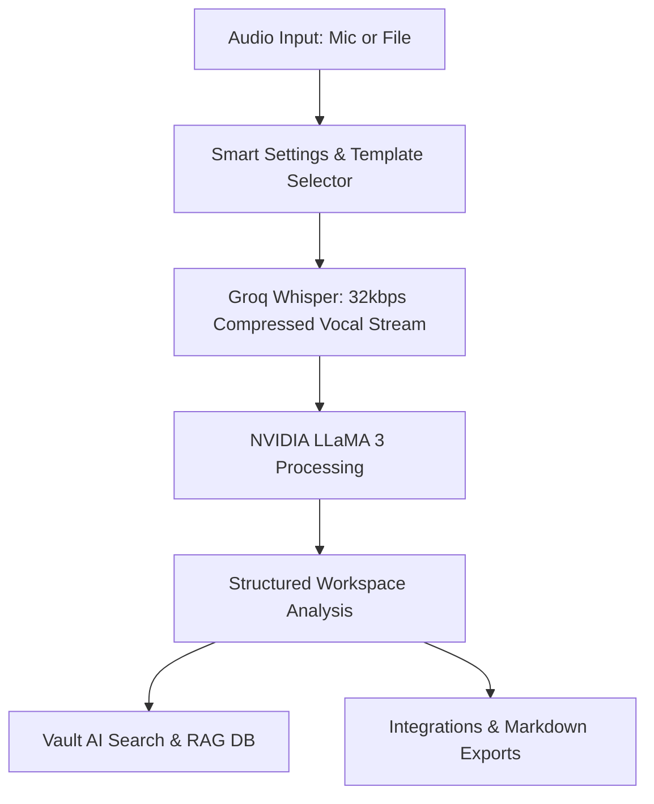

# Verbatim — The AI Meeting & Lecture Note Taker
### Official User Guide & System Documentation

Welcome to **Verbatim**, a premium, AI-powered meeting and lecture companion built with Next.js, Supabase, Tailwind CSS, Groq Whisper, and NVIDIA LLaMA 3. 

This guide provides a comprehensive overview of how to capture, process, search, and export your audio notes. Whether you are daily-syncing with your team, recording a candidate interview, or capturing a 2-hour university lecture, Verbatim automates the structural analysis of your conversations so you can focus on the meeting itself.

---

## Table of Contents
1. [Key Features & Design System](#1-key-features--design-system)
2. [Getting Started](#2-getting-started)
3. [The Workspace Interface](#3-the-workspace-interface)
4. [Setting Up Your Recording Session](#4-setting-up-your-recording-session)
5. [The AI Processing Pipeline](#5-the-ai-processing-pipeline)
6. [Analyzing Meeting Results](#6-analyzing-meeting-results)
7. [Meeting Vault & RAG-Powered Semantic Search](#7-meeting-vault--rag-powered-semantic-search)
8. [Export Actions & Third-Party Integrations](#8-export-actions--third-party-integrations)
9. [Subscription Tiers (Free vs. Pro)](#9-subscription-tiers-free-vs-pro)
10. [Troubleshooting & Best Practices](#10-troubleshooting--best-practices)

---

## 1. Key Features & Design System

Verbatim is designed with premium, high-fidelity visual aesthetics (harmonious dark themes, elegant transitions, and fluid animations).



* **Dynamic UI & Motion Design:** Full responsive layout, fluid framer-motion micro-animations, glassmorphic card overlays, and subtle UI hover feedbacks.
* **Intelligent Audio Compression:** Compresses real-time vocal streams to **32kbps mono voice codec** before uploading. This slashes network payloads by 80% and ensures instantaneous transcription even on sluggish connections.
* **RLS Tier Restrictions:** Multi-layered security schema built directly onto the Supabase PostgreSQL layer, restricting subscription downgrades/upgrades to server-side validators.

---

## 2. Getting Started

### Accessing the Application
1. Start your local environment using:
   ```bash
   npm run dev
   ```
2. Open your web browser and navigate to:
   [http://localhost:3000](http://localhost:3000)
3. Connect your account via the **Log in** button on the navbar. If you do not have an account, the authentication middleware will guide you to set up a secure profile.

> [!NOTE]
> Verbatim uses Supabase SSR Authentication to protect user workspaces. All dashboard, meeting detailed sheets, and settings require an authenticated session.

---

## 3. The Workspace Interface

Once logged in, the primary workspace is split into two panels designed for visual efficiency:

| Panel | Description | Key Interactive Elements |
| :--- | :--- | :--- |
| **Left Control Panel** *(Recorder)* | Houses the active capture tools, session metadata, audio waveforms, timer, and AI parameters. | Meeting Name Input, Active Waveform Canvas, Template Buttons, Mode Switcher, Parameter Knobs. |
| **Right Detail Panel** *(Results)* | Displays the fully processed session deliverables divided into multi-tab sheets. | Audio Playback, Stats Row, Speaker Chips, TLDR, Transcript, Action Items, Deep Insights. |

---

## 4. Setting Up Your Recording Session

Before starting a recording, you can configure your session to match the exact context of your discussion.

### Step 1: Name Your Meeting
At the top of the Left Panel, click the default name **"New Meeting"** and type a customized title (e.g., `Q3 Product Strategy Sync`). The application will stamp the meeting with the current weekday, month, and date automatically.

### Step 2: Select a Meeting Template
If you want to apply instant settings optimized for specific meeting types, choose from the pre-configured grid:

* **Standup:** Enabled speaker identification (diarization), enabled action extraction, summarized in concise bullets. Perfect for daily syncs.
* **Interview:** Enabled speaker identification, disabled action extraction, formatted in detailed, clean narratives.
* **Lecture:** Disabled speaker identification (single main speaker), disabled action items, formatted in exhaustive detailed summary paragraphs.
* **Sales Call:** Enabled speaker diarization, enabled actions, formatted in highly detailed client summary notes.
* **Brainstorm:** Enabled speaker diarization, enabled action items, summarized in flexible, rapid bullet points.
* **Podcast:** Enabled diarization, disabled action items, summarized in detailed paragraphs tracking key dialog segments.

> [!TIP]
> Selecting a template will automatically suggest an appropriate title for your meeting if you haven't renamed it!

### Step 3: Choose Your Capture Mode
* **Microphone Mode (Live Capture):** Utilizes your device's default microphone. Shows a live, animated visualizer canvas matching your vocal frequencies.
* **Upload Mode (Pre-recorded Files):** Allows you to upload pre-recorded meetings or classes.
  * *Supported file formats:* `.mp3`, `.wav`, `.m4a`, `.webm`, `.mp4`.
  * *File size limit:* Strictly validated up to **25 MB** to ensure fast serverless execution.

### Step 4: Refine Processing Parameters
Under **Recorder Settings**, toggles are available to fine-tune the AI execution context:
* **Speaker Diarization:** Toggle this on to automatically distinguish who said what (e.g., `Speaker 1`, `Speaker 2`).
* **Action Items Extraction:** Toggle this on to let the AI build an interactive, prioritized task list.
* **Language Select:** Pick the spoken language (English, Spanish, French, German, Italian, etc.) to optimize the transcription engine.
* **Summary Style:** Choose between **Detailed** (full structural breakdown), **Concise** (high-level paragraphs), and **Bullets** (rapid key takeaways).

---

## 5. The AI Processing Pipeline

When you click **Process with AI**, Verbatim initiates a secure, multi-stage transaction:

```
[Audio Capture] ➔ [32kbps Vocal Compression] ➔ [Groq Whisper (STT)] ➔ [LLaMA 3 (Nvidia NIM)] ➔ [Structured JSON Output]
```

1. **Vocal Compression:** Raw audio chunk files are combined and compressed using the client-side recorder.
2. **Audio Filtering & Upload:** The backend verifies size constraints (max 25MB) and processes the payload.
3. **Whisper Transcription (Groq Engine):** Groq's high-speed Whisper implementation transcribes the voice stream.
4. **LLaMA 3 Insights Engine (Nvidia):** Analyzes the raw transcript using a system role prompt injection. It separates the summary, identifies speakers, drafts actions, and isolates key sentiments.
5. **JSON Structuring:** Generates a clean, validated JSON package that is piped to the client UI and cached in the Supabase DB.

---

## 6. Analyzing Meeting Results

Once processed, the Right Panel lights up with structured deliverables. Let's explore the four analytical tabs:

### 1. Stats Row & Speaker Chips
* **Stats Row:** High-level metrics showing the exact session duration, total word count, and unique speaker count.
* **Speaker Chips:** Color-coded speaker identifiers showing who participated.

### 2. Tab 1: TLDR
* **Key Quote:** A featured visual block showcasing the most impactful quote of the entire meeting.
* **Main Points:** A chronological list of key highlights, summaries, and thematic milestones.

### 3. Tab 2: Transcript
* A beautiful, interactive chat-style view of the entire conversation.
* If diarization was enabled, messages are categorized by speaker chips with matching timestamps.
* A built-in custom audio player lets you listen back to the meeting recording at any time.

### 4. Tab 3: Actions
An interactive checklist of tasks extracted by the AI:
* **Task checkboxes:** Mark tasks as completed on the fly.
* **Priority tags:** Color-coded priority badges (`High`, `Medium`, `Low`).
* **Assignee badges:** Shows who is responsible for each task based on the transcript context.

### 5. Tab 4: Insights
* **Sentiment Indicator:** Displays the overall emotional tone of the discussion:
  * 🟢 **Aligned:** Positive, constructive, collaborative agreement.
  * 🟡 **Uncertain:** Undecided issues, speculative discussions.
  * 🔴 **Tense:** Strong debate, conflicting opinions.
* **Decisions Log:** A clean bullet-point summary of all formal decisions agreed upon.
* **Risks identified:** A section warning about highlighted roadblocks, technical debt, or missed milestones.

---

## 7. Meeting Vault & RAG-Powered Semantic Search

The **Meeting History** tab (`/meetings`) houses your secure meeting vault.

```
+───────────────────────────────────────────────────────────+
| [Sparkles] Vault AI Search                                |
| [ Search history, or ask "What did we decide?"        ]   |
+───────────────────────────────────────────────────────────+
```

### Vault AI Search (RAG Engine)
You can search previous records by matching titles. However, the true power of Verbatim lies in **Vault AI Search**:
1. Type a natural language question in the search bar ending with a question mark (`?`), for example:
   * *“What did we decide about the budget?”*
   * *“Who is responsible for the API deployment?”*
   * *“What was the main topic of the marketing brainstorm?”*
2. Press the **Send (arrow)** button or hit **Enter**.
3. Verbatim's RAG system performs a semantic lookup across all your historical meeting transcripts, feeds the relevant contexts into the AI, and outputs a synthesized, paragraph-long **Vault AI** answer directly in an animated card.

### Sentiment Filters
Quickly filter your entire history using sentiment tags on the top right:
* Click **Aligned** to see only collaborative, highly productive meetings.
* Click **Tense** to immediately pull up meetings featuring heavy debates or outstanding conflicts.
* Click **Uncertain** to find meetings where follow-up clarifications are still pending.

---

## 8. Export Actions & Third-Party Integrations

You can export your completed meeting notes using the premium **Export** dropdown button:

```
[Export Button]
 ├── Copy Summary (Markdown format)
 ├── Copy Transcript (Timestamped dialogue)
 ├── Copy Action Items (Priority + Assignee list)
 ├── Download .txt (Clean structural file)
 ├── Download .md (Full GitHub-flavored Markdown)
 └── Send to Notion (Sync notes directly into Notion databases)
```

* **Markdown Exports:** Downloads a fully structured GFM document complete with metrics, summaries, key quote blockquotes, task checklists, and tabular insights.
* **Notion Workspace Integration:** Syncs your complete processed deliverable package into your Notion workspace with a single click. Displays real-time toast feedback on completion.

---

## 9. Subscription Tiers (Free vs. Pro)

Verbatim offers flexible tiers depending on your organization's note-taking requirements:

| Feature | Free Tier | Pro Tier ($9.99/mo) |
| :--- | :---: | :---: |
| **Active Transcriptions** | Limited per month | **Unlimited** |
| **Max File Upload Size** | Under 10 MB | **Up to 25 MB** |
| **Speaker Diarization** | Basic | **Advanced Multi-Speaker** |
| **Export Formats** | Copy text only | **Markdown, TXT, Notion Workspace** |
| **Vault AI Search** | Not available | **Unlimited Semantic Queries** |
| **Support** | Community forums | **Priority Dev Support** |

---

## 10. Troubleshooting & Best Practices

To get the absolute best results from Verbatim, consider the following technical recommendations:

> [!TIP]
> **Microphone Placement:** For clear speaker diarization, ensure the microphone is placed centrally in the meeting room or use a dedicated USB boundary mic.
>
> **Background Noise:** Try to record in spaces with minimal background echoes. The AI can filter light noise, but severe acoustics might blur speaker separations.
>
> **File uploads:** If your file exceeds 25MB, use a free audio compression utility (like Audacity or FFmpeg) to output a compressed mono vocal stream before uploading.

### Frequently Asked Questions
* **Q: Why does my upload fail?**
  * *A:* Verify your file is under the 25MB safety boundary and has an approved audio format extension.
* **Q: How does the app handle long processing times?**
  * *A:* We've optimized the API timeouts to 60 seconds on serverless hosts. If a meeting is exceptionally long, use the Free vocal compression switch to keep files light!

---
*Developed with excellence by the Verbatim team. © 2026. All rights reserved.*
