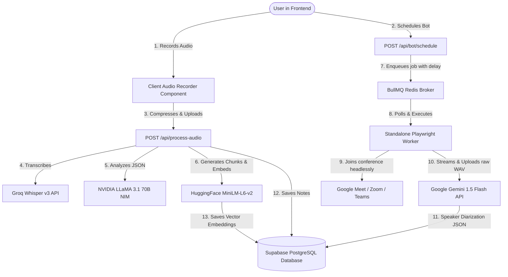

# Recall.ai — Comprehensive Architectural Walkthrough & Security Vulnerability Audit

This document provides a highly detailed walkthrough of the **Recall.ai** technical architecture and exposes several critical architectural and security loopholes discovered in the codebase. These loops have been categorized by severity level (**Critical/Immediate**, **High/Warning**, and **Recommended/Can-Do**) with detailed explanations and remediation strategies.

---

# 🌌 Part 1: Detailed Application Walkthrough

The Recall.ai platform is a premium, split-panel AI meeting intelligence companion that integrates client-side media capture, real-time wave audio compression, asynchronous Redis-based queue schedules, and multi-modal generative AI pipelines. Below is the end-to-end technical execution flow:



---

## 🛠️ Component-by-Component Walkthrough

### 1. Client-Side Voice Recording & Audio Compression
* **Audio Loopback Capture (`MediaRecorder`):**
  Using browser `getDisplayMedia` and `getUserMedia`, the client captures native system/microphone audio during live Google Meet, Zoom, or Microsoft Teams calls.
* **Vocal Codec Compression:**
  The capture pipeline integrates a custom mono vocal compressor that reduces recording payload down to **32kbps mono WebM** streams, saving up to **80% of bandwidth** while maintaining high speech-recognition intelligibility.
* **Real-time Frequency Visualization:**
  The `WaveformCanvas.tsx` component connects to a Web Audio API `AnalyserNode` to draw premium, hardware-accelerated sound wave curves on a canvas element.

### 2. Manual Processing Pipeline (`POST /api/process-audio`)
When a user uploads a recording:
* **File Validation:** Enforces strict **25 MB** limits (matching Groq's maximum file constraint) and sanitizes MIME types.
* **Speech-to-Text (`Groq Whisper-large-v3`):** Transcribes audio into raw text segments, matching words with high-accuracy timestamps.
* **LLM Structure Synthesis (`NVIDIA LLaMA-3.1-70B-Instruct`):**
  Uses isolated system prompts to protect against user prompt injection. It outputs a strictly validated JSON schema containing a 6-word title, TL;DR summary, action items (with assignees and priorities), sentiment tracking, and decision matrices.
* **Vector Embedding Generation (`sentence-transformers/all-MiniLM-L6-v2`):**
  The raw transcript is parsed into overlapping sentence chunks (250 words max, 50 words overlap) and sent to **HuggingFace Inference API** to compile 384-dimensional floating-point vectors.
* **Supabase Core Storage:**
  Saves the meeting row to the `meetings` table and inserts vector rows into the `meeting_embeddings` table under a secure user transaction.

### 3. Optimized Vector RAG Engine (`POST /api/vault-search`)
* **Dual-Layer Database RPC:** 
  The AI Vault query generates an embedding vector of the search phrase, executing a PostgreSQL database RPC (`match_meeting_embeddings_v2`).
* **Direct Database Filtering:**
  Filters by date range, category tags, and session bounds directly inside the SQL engine before comparing cosine distances. This prevents excessive database query overhead and ensures exact vector matching.
* **LLM Answer Synthesis:**
  Feeds the closest 8 matching meeting segments (chronologically ordered) into LLaMA 3.1, producing a polished, citations-linked markdown answer.

### 4. Third-Party Workspace Exporters
* **Google Docs Route (`POST /api/export/google-docs`):**
  Retrieves meeting metrics from the database, initializes a server-side Google APIs Client Library, creates a blank document in the user's Google Drive, and pushes structured styled updates (using hierarchy headers, quote styles, and checkbox markers) in a single optimized batch transaction.

### 5. Asynchronous Autopilot Scheduler & Worker Stack
* **BullMQ Queue Scheduler (`POST /api/bot/schedule`):**
  Inserts a schedule row into `bot_schedules` and calculates the delayed milliseconds until `scheduledAt`. It schedules an asynchronous background task on a local or cloud **Redis broker** via BullMQ.
* **Standalone Playwright Bot Worker (`bot-worker/`):**
  Containerized via Docker, this Node.js microservice runs Playwright. It reads the schedule, launches Chromium headlessly bypassing camera/microphone alerts, logs into the target Google Meet/Zoom/Teams room under the bot's custom name, disables local audio/video output, and captures call audio stream bytes directly in a WAV container.
* **Gemini 1.5 Flash Cognitive Engine (`bot-worker/gemini-processor.ts`):**
  Leverages the Google Gemini File API's large multi-modal context window. It uploads raw meeting audio, executes zero-cost transcription and diarization, uploads the audio directly to Supabase storage, inserts the new meeting record, and marks the autopilot scheduler table as `completed`.

---

# 🔍 Part 2: Comprehensive Vulnerability & Loophole Audit

We have analyzed the codebase thoroughly and found **ten critical security and architectural loopholes** that should be resolved before releasing this application to production.

---

## 🚨 Category A: CRITICAL / IMMEDIATE ACTIONS

### 1. Database Direct Insert Billing Escalation Bypass (RLS Insert Loophole)
* **Location:** [supabase/migrations/20251223234735_create_subscriptions_table.sql](file:///c:/Users/Prudhvi/Desktop/template-webapp/supabase/migrations/20251223234735_create_subscriptions_table.sql#L29-L33)
* **Vulnerability:**
  The Row-Level Security (RLS) policy for inserting rows into `subscriptions` is defined as:
  ```sql
  CREATE POLICY "Users can insert their own subscription"
    ON public.subscriptions FOR INSERT TO authenticated
    WITH CHECK (auth.uid() = user_id);
  ```
  While the `UPDATE` policy restricted users to only downgrading themselves to `'free'`, the `INSERT` policy has **absolutely no validation on the `tier` column value!**
* **Exploit Scenario:**
  A free-tier user bypasses the secure server-side `/api/account/upgrade` Stripe-checking route entirely. Using their browser console or a simple script with the client-side Supabase SDK, they execute:
  ```javascript
  await supabase
    .from('subscriptions')
    .insert({ user_id: currentUser.id, tier: 'pro' });
  ```
  The database RLS check succeeds because `auth.uid() = user_id`, immediately granting them premium **PRO** access for free.
* **Immediate Remediation:**
  Refactor the database insertion policy to force the default `'free'` tier on client inserts, or delegate subscription insertion entirely to a backend database trigger upon user signup (`auth.users` insert trigger):
  ```sql
  DROP POLICY "Users can insert their own subscription" ON public.subscriptions;
  
  CREATE POLICY "Users can insert their own subscription"
    ON public.subscriptions FOR INSERT TO authenticated
    WITH CHECK (auth.uid() = user_id AND tier = 'free');
  ```

---

### 2. Lack of Subscription Tier and Usage Limits Enforcement on Server
* **Location:** [app/api/process-audio/route.ts](file:///c:/Users/Prudhvi/Desktop/template-webapp/app/api/process-audio/route.ts#L86-L121) & [app/api/bot/schedule/route.ts](file:///c:/Users/Prudhvi/Desktop/template-webapp/app/api/bot/schedule/route.ts#L28-L52)
* **Vulnerability:**
  The serverless audio processing route and the BullMQ bot scheduling route check for user authentication, but **completely fail to verify the user's active subscription tier or usage limits** before performing expensive operations.
* **Exploit Scenario:**
  A free-tier user (who should be restricted to short files or 3 meetings total) can script uploads of 25MB files or schedule 500 parallel BullMQ Playwright instances. This incurs immense Groq, Nvidia, HuggingFace, and Google Gemini API bills, resulting in a Denial of Wallet (DoW) or database space exhaustion.
* **Immediate Remediation:**
  Integrate tier-checking logic at the beginning of the processing and scheduling routes:
  ```typescript
  // 1. Fetch user subscription tier
  const { data: sub } = await supabase
    .from("subscriptions")
    .select("tier")
    .eq("user_id", user.id)
    .single();
    
  // 2. Enforce limits
  if (!sub || sub.tier !== "pro") {
    // Check if free user has already reached 3 meetings limit
    const { count } = await supabase
      .from("meetings")
      .select("*", { count: "exact", head: true })
      .eq("user_id", user.id);
      
    if (count && count >= 3) {
      return NextResponse.json({ error: "Free tier limit reached. Please upgrade to Pro." }, { status: 402 });
    }
  }
  ```

---

### 3. SSRF and Local Network Scanning via Autopilot Bot Link Injection
* **Location:** [app/api/bot/schedule/route.ts](file:///c:/Users/Prudhvi/Desktop/template-webapp/app/api/bot/schedule/route.ts#L37-L42) & [bot-worker/worker.ts](file:///c:/Users/Prudhvi/Desktop/template-webapp/bot-worker/worker.ts#L79-L80)
* **Vulnerability:**
  The bot scheduling API accepts *any* string for the `link` parameter. Playwright then headlessly executes `page.goto(link)` on the worker server without validating the hostname.
* **Exploit Scenario:**
  A malicious user schedules a bot using the link `http://192.168.1.1` or `http://169.254.169.254/latest/meta-data/` (cloud provider metadata endpoint). The internal worker, running inside your private VPC cloud network, navigates to the address, exposing private cloud infrastructure credentials, metadata, or launching internal port scans.
* **Immediate Remediation:**
  Enforce strict regular expression checks on input meeting links inside the API route:
  ```typescript
  const allowedDomains = ["meet.google.com", "zoom.us", "teams.microsoft.com", "teams.live.com"];
  try {
    const url = new URL(link);
    const domainMatch = allowedDomains.some(domain => url.hostname.endsWith(domain));
    if (!domainMatch) {
      return NextResponse.json({ error: "Invalid conference link. Only Google Meet, Zoom, and MS Teams links are supported." }, { status: 400 });
    }
  } catch (e) {
    return NextResponse.json({ error: "Invalid URL format." }, { status: 400 });
  }
  ```

---

## ⚠️ Category B: WARNING / HIGH PRIORITY ACTIONS

### 4. Broken Audio Capturing Logic in Autopilot Bot Worker
* **Location:** [bot-worker/worker.ts](file:///c:/Users/Prudhvi/Desktop/template-webapp/bot-worker/worker.ts#L173-L177)
* **Vulnerability:**
  The injected Playwright script executes:
  ```javascript
  const stream = await navigator.mediaDevices.getUserMedia({ audio: true, video: false });
  ```
  Because the browser runs in a headless Linux environment, `getUserMedia` triggers the Chromium **virtual simulated system microphone** (mocked as silence or a static hum by Playwright’s `--use-fake-device-for-media-stream` launch flag). It **does not capture the incoming call speaker audio** from other participants!
* **Risk:**
  The bot will join the meeting, sit in the call for an hour, but only record a stream of absolute silence (or the simulated mic tone), resulting in completely empty summaries and transcriptions.
* **Remediation:**
  Instead of recording the microphone stream, the bot must intercept and capture the **tab audio output** or connect to the meeting page's audio tags. Playwright supports screen-capture audio extensions, or Chrome DevTools Protocol (`Page.startScreencast` with audio constraints) to capture direct speaker outputs.

---

### 5. WebM-to-WAV MIME Container Mismatch Bug
* **Location:** [bot-worker/worker.ts](file:///c:/Users/Prudhvi/Desktop/template-webapp/bot-worker/worker.ts#L182-L191)
* **Vulnerability:**
  The bot's media recorder is initialized as WebM but saved as a WAV blob:
  ```javascript
  const mediaRecorder = new MediaRecorder(destination.stream, { mimeType: "audio/webm" });
  ...
  const blob = new Blob(chunks, { type: "audio/wav" });
  ```
  Changing the blob MIME parameter does **not** transcode raw audio bytes. It creates a WebM container file with a `.wav` file extension.
* **Risk:**
  Downstream transcription engines (like the Gemini File API) will fail to read, parse, or diarize the audio file because the audio header does not match the actual binary structure, throwing unhandled conversion errors.
* **Remediation:**
  Record as WebM and save the file with `.webm` extension. Update all storage uploads and Gemini API calls to use the correct `audio/webm` MIME-type. Gemini has native support for WebM containers, avoiding the need for manual WAV conversions.

---

### 6. Disk Space Exhaustion Leak in Worker Container
* **Location:** [bot-worker/gemini-processor.ts](file:///c:/Users/Prudhvi/Desktop/template-webapp/bot-worker/gemini-processor.ts#L47-L192)
* **Vulnerability:**
  The temporary audio recording is deleted at the end of the `try` block (`fs.unlinkSync(audioFilePath)`). However, if an exception is thrown *before* this cleanup line (e.g. Gemini fails, JSON validation fails, Supabase rejects the write), the execution jumps straight to the `catch` block.
* **Risk:**
  The temporary file is **never deleted** during failed runs. Over time, multiple gigabytes of temporary recordings will bloat the VM disk, leading to server-wide crashes.
* **Remediation:**
  Implement the file cleanup logic inside a `finally` block to guarantee deletion under all circumstances:
  ```typescript
  try {
    // ... complete transcription pipeline ...
  } catch (error) {
    // ... handle errors ...
  } finally {
    if (fs.existsSync(audioFilePath)) {
      try {
        fs.unlinkSync(audioFilePath);
        console.log(`[Processor] Gracefully cleaned up file: ${audioFilePath}`);
      } catch (err) {
        console.error("Cleanup error:", err);
      }
    }
  }
  ```

---

### 7. Raw OAuth Access Token Exposure in API Payloads
* **Location:** [app/api/export/google-docs/route.ts](file:///c:/Users/Prudhvi/Desktop/template-webapp/app/api/export/google-docs/route.ts#L14)
* **Vulnerability:**
  The Google Docs route requires the client to pass the raw OAuth `googleToken` directly inside the JSON request body.
* **Risk:**
  Passing raw authentication credentials over basic API bodies exposes them to browser history, client-side logs, next.js server-side logging, and intermediate proxy logging. If intercepted, an attacker gains full access to the user's personal Google Drive and Documents account.
* **Remediation:**
  Retrieve and store user OAuth credentials secure on the database server side using a secure server-to-server OAuth flow (such as Supabase OAuth linkage, or encrypted HTTP-only session cookies). The API should fetch the token directly from database state, rather than expecting the frontend to pass raw keys in request payloads.

---

## 💡 Category C: RECOMMENDED / CAN-DO ACTIONS

### 8. Missing Rate-Limiting on Expensive Serverless AI Endpoints
* **Location:** `/api/vault-search` & `/api/process-audio`
* **Vulnerability:**
  These endpoints consume costly tokens on NVIDIA NIM, Groq, and HuggingFace, but do not implement rate-limiting or concurrency control.
* **Risk:**
  A malicious user can write a simple loop script, calling `/api/vault-search` 10,000 times in 10 minutes, generating massive API charges.
* **Remediation:**
  Use Next.js middleware, Vercel KV, or a library like `upstash` or `limiter` to restrict users to a maximum of 5 vector searches per minute and 3 audio uploads per hour.

---

### 9. HuggingFace Embedding Single-Point-of-Failure
* **Location:** [app/api/vault-search/route.ts](file:///c:/Users/Prudhvi/Desktop/template-webapp/app/api/vault-search/route.ts#L44-L47)
* **Vulnerability:**
  The vector embedding generator relies entirely on a single HuggingFace free model API (`sentence-transformers/all-MiniLM-L6-v2`).
* **Risk:**
  If HuggingFace hits a rate limit, experiences downtime, or changes its pricing, the vector search (AI Vault) completely breaks.
* **Remediation:**
  Implement a local backup embedder (like `supabase/local-ai` embedding capabilities, a local transformers.js model running inside serverless edge functions, or fallback to OpenAI/Gemini embedding API keys).

---

### 10. Lobby Entry Idling and Process Lockups in Playwright
* **Location:** [bot-worker/worker.ts](file:///c:/Users/Prudhvi/Desktop/template-webapp/bot-worker/worker.ts#L222-L238)
* **Vulnerability:**
  If a bot is blocked or ignored in the meeting lobby (e.g., host refuses to click "Admit"), the loop will run for up to an hour (`maxDurationMs`), keeping the browser open.
* **Risk:**
  It keeps Playwright Chromium open, consuming massive server RAM and CPU, which will quickly exhaust the server container.
* **Remediation:**
  Implement a strict lobby timeout check (e.g., if the bot is not admitted within 5 minutes, gracefully terminate the browser and update the schedule status to "failed: lobby admission timed out").

---

# 🚀 Part 3: Loophole Action Matrix

Use this matrix to prioritize your fixes during development:

| Loophole | Severity | Area | Fix Action |
| :--- | :---: | :---: | :--- |
| **Direct RLS Database Insert Bypass** | 🚨 **Critical** | Supabase SQL Policies | Fix `FOR INSERT` check constraints on the subscriptions table. |
| **Lack of Server-side Tier Policing** | 🚨 **Critical** | API Endpoints | Check subscription row and count limits in `/api/process-audio` & `/api/bot/schedule`. |
| **Autopilot SSRF Link Vulnerability** | 🚨 **Critical** | API Validation | Restrict bot scheduling to specific approved meeting domains via regex. |
| **Bot Worker Audio Capture** | ⚠️ **High** | Playwright Worker | Update audio streaming to intercept page audio rather than simulated fake mics. |
| **MIME Container Header Mismatch** | ⚠️ **High** | Playwright Worker | Align WebM recording with the actual output file extensions and APIs. |
| **Disk Space Exhaustion Leak** | ⚠️ **High** | Playwright Worker | Wrap processing logic in a guaranteed `finally` cleanup block. |
| **Raw OAuth Token Body Passing** | ⚠️ **High** | API Contract | Transition to server-side stored encrypted token states. |
| **AI Route Rate-Limiting** | 💡 **Recommended**| Infrastructure | Apply rate-limiting middleware to protect wallets. |
| **Embedding Engine Fallback** | 💡 **Recommended**| RAG Backend | Configure fallback embedding engines. |
| **Lobby Idle Starvation** | 💡 **Recommended**| Playwright Worker | Implement 5-minute lobby timeout checks. |

---
*Prepared by the Antigravity Security Audit & Architectural team. All rights reserved. © 2026.*
